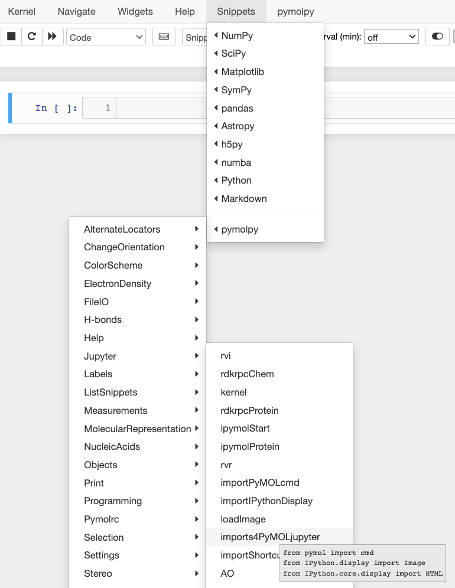

as# jupyternbclassicpymolpysnips

PyMOL Python snippets for the Classic Jupyter Notebook.

## Features
The 250 snippets are installed in the single JavaScript file, `custom.js`.
It is assumed that you have the nbextensions module already installed and the snippets_menu extension activated.

The snippets are in cascading pull-down menus.
A preview (see gray box below) of the selected snippet is displayed prior to hitting `enter` to insert the snippt in the current code cell.

## Installation and usage

- git clone this repository.
- Copy custom.js to `~/.jupytedssadr/custom/custom.js`.
- Start `jupyter notebook` (versions 6 and older)
- Start `jupyter nbclassic` (Juyter Notebook version 7 or newer).
- Select a snippet from the pymolpy menu edits in the nav bar. 

## Related repos

